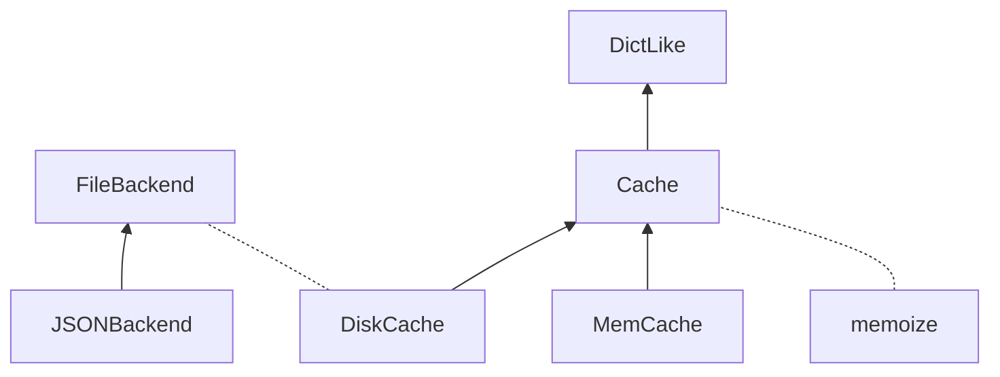

```mermaid
sequenceDiagram
    actor user

    %% initialization
    user ->>+ __init__: file_path
    __init__ ->> super().__init__: file_path
    deactivate __init__

    %% writing for the first time
    user ->>+ write: d
    write ->>+ __acquire_lock: None
    __acquire_lock ->> file system: mkdir(file_path.parents)
    __acquire_lock ->> file system: touch(file_path + ".lock")
    __acquire_lock ->> file system: chmod(file_path + ".lock")
    deactivate __acquire_lock
    write ->>+ _write: d
    _write ->>+ file system: open(file_path)
    file system -->>- _write: fp
    _write ->> file system: write(fp)
    _write ->> file system: close(fp)
    deactivate _write
    write ->>+ __release_lock: None
    __release_lock ->> file system: chmod(file_path + ".lock")
    deactivate __release_lock
    deactivate write

    %% reading for the first time TODO
```